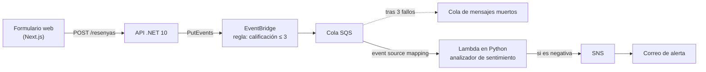

# WorkingEvents

Laboratorio de estudio sobre arquitectura orientada a eventos en AWS. Unos clientes dejan
reseñas en una plataforma; el sistema las procesa **en tiempo real y de forma asíncrona**,
analiza el texto y **envía una alerta por correo** cuando una reseña es negativa.

Está hecho con .NET 10, Next.js, Python y Terraform sobre EventBridge, SQS, Lambda y SNS.

> Es un proyecto de aprendizaje. Cada decisión está explicada desde cero en [`docs/`](docs/),
> incluidos los errores que se cometieron por el camino y cómo se descubrieron.

---

## Cómo funciona



1. La **API** valida la reseña, publica el evento `ResenyaEnviada` y responde `202 Accepted`,
   porque el análisis ocurre después.
2. **EventBridge** filtra por metadatos: solo las reseñas de 3 estrellas o menos siguen
   adelante.
3. **SQS** las guarda hasta que se procesan. Si algo falla, se reintenta, y tras tres fallos el
   mensaje se aparta a la cola de mensajes muertos.
4. El **event source mapping** recoge los mensajes de la cola e invoca la Lambda.
5. La **Lambda** analiza el texto. Si es negativo, o si la calificación es de 1 estrella,
   publica en SNS.
6. **SNS** envía el correo, con el comentario, el motivo y las palabras que hicieron saltar la
   alerta.

## Estado

| Fase | Contenido | Estado |
|---|---|---|
| 0 | Entorno, cuenta y herramientas | ✅ |
| 1 | Estructura del proyecto | ✅ |
| 2 | Infraestructura de eventos: EventBridge, SQS, SNS | ✅ |
| 3 | API en .NET 10 | ✅ |
| 4 | Lambda con analizador de sentimiento | ✅ probada de punta a punta |
| 5 | Frontal en Next.js | ✅ |
| 6 | Observabilidad: alarmas y cola de mensajes muertos | ✅ probada provocando fallos |
| 7 | Análisis con Claude: API de Anthropic y Secrets Manager | pendiente |
| 8 | Hospedar la web y la API en AWS | pendiente |

## Estructura

```
infra/            Terraform: bus, regla, colas, topics, Lambda, alarmas e interruptor de apagado
src/api/          API en .NET 10 que publica las reseñas
src/web/          Frontal en Next.js: el formulario de reseñas
src/lambda/
  funcion/        El código que se despliega en Lambda
  pruebas/        21 pruebas con unittest, sin dependencias
  simulacion/     Simulación en local del event source mapping
pruebas/          Eventos de ejemplo para publicar a mano con el CLI
docs/             La documentación, tema a tema
```

## Documentación

Por orden de lectura:

| Documento | De qué trata |
|---|---|
| [ARQUITECTURA](docs/ARQUITECTURA.md) | Qué es cada pieza, explicado desde cero, y por qué está ahí |
| [ENTORNO](docs/ENTORNO.md) | Herramientas, perfiles, limitaciones de la cuenta y trampas de Windows |
| [ANALISIS-DE-SENTIMIENTO](docs/ANALISIS-DE-SENTIMIENTO.md) | Las opciones, la que se eligió y cómo funciona el analizador por dentro |
| [INFRAESTRUCTURA](docs/INFRAESTRUCTURA.md) | El Terraform fichero a fichero, el correo de SNS y el apagado |
| [PRUEBA-MANUAL](docs/PRUEBA-MANUAL.md) | `PutEvents` pieza a pieza: el sobre, la carta y el visibility timeout |
| [API](docs/API.md) | La API en .NET 10, línea a línea |
| [CONFIGURACION-API](docs/CONFIGURACION-API.md) | `appsettings.json` frente a `launchSettings.json`, y cómo la task definition de ECS sustituirá a este último en la Fase 8 |
| [LAMBDA](docs/LAMBDA.md) | La función, su rol, sus permisos y su código |
| [EVENT-SOURCE-MAPPING](docs/EVENT-SOURCE-MAPPING.md) | Cómo se comunican la cola y la Lambda, y dónde verlo en la consola |
| [PRUEBA-DE-PUNTA-A-PUNTA](docs/PRUEBA-DE-PUNTA-A-PUNTA.md) | La prueba final y todo lo que enseñaron los logs |
| [FRONTAL](docs/FRONTAL.md) | El formulario en Next.js, y CORS explicado desde cero |
| [OBSERVABILIDAD](docs/OBSERVABILIDAD.md) | Tres alarmas, cómo se probaron provocando fallos, y qué hacer cuando salta la de la DLQ |

## Puesta en marcha

### Requisitos

- .NET 10 SDK
- Python 3.13
- Terraform 1.10 o posterior (se usó la 1.15)
- AWS CLI v2 y un perfil con permisos para crear los recursos
- Un bucket de S3 para el estado de Terraform

### 1. Infraestructura

```powershell
cd infra
copy terraform.tfvars.example terraform.tfvars      # rellena la cuenta y el correo
$env:AWS_PROFILE = '<tu-perfil>'
terraform init -backend-config="bucket=<bucket-de-estado>"
terraform plan -out=plan.tfplan
terraform apply plan.tfplan
```

Después del primer `apply`, AWS envía un correo de confirmación a la dirección de las alertas.
**Hasta que no se pulsa el enlace, no llega ninguna alerta.**

### 2. API

El perfil de AWS está en `src/api/Properties/launchSettings.json`, en la variable
`AWS_PROFILE`. Cámbialo por el tuyo.

```powershell
dotnet run --project src/api
```

Escucha en `http://localhost:5080`. Para mandar una reseña:

```powershell
Invoke-RestMethod -Method Post -Uri http://localhost:5080/resenyas -ContentType 'application/json' -Body '{"comentario":"Llegó roto y nadie contesta","calificacion":2,"email":"cliente@ejemplo.com"}'
```

### 3. Frontal

Con la API arrancada, en otra terminal:

```powershell
cd src/web
npm install
copy .env.example .env.local
npm run dev
```

Se abre en `http://localhost:3000`. Una reseña negativa o de 1 estrella **envía un correo de
alerta de verdad**; para probar sin correos, usa 3 estrellas y un texto neutro.

### 4. Pruebas de la Lambda

```bash
python -B -m unittest discover -s src/lambda/pruebas -v
python -B src/lambda/simulacion/simular_esm.py
```

## Apagar

Todo es de pago por uso: si no llegan reseñas, el coste es cero sin apagar nada. Aun así hay un
interruptor para cortar un bucle desbocado sin destruir nada:

- `flujo_activo = false` en `terraform.tfvars` y `apply`: la regla deja de enrutar y la Lambda
  deja de consumir la cola.
- `terraform destroy` lo elimina todo.

Los detalles están en [INFRAESTRUCTURA](docs/INFRAESTRUCTURA.md#9-apagadotf-el-freno-de-mano).

## Lo que no está en el repositorio

Tres datos se quedan fuera a propósito, porque son personales o identifican la cuenta:

| Dato | Dónde va |
|---|---|
| Número de cuenta de AWS | `infra/terraform.tfvars`, en `.gitignore` |
| Correo de las alertas | `infra/terraform.tfvars`, en `.gitignore` |
| Nombre del bucket de estado | Se pasa a `terraform init` con `-backend-config`, porque contiene el número de cuenta |
