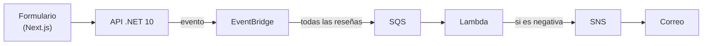

# La arquitectura, desde cero

Qué hace cada pieza, por qué está ahí y qué cuesta. No da nada por sabido: si un término
aparece, se explica antes de usarlo.

---

## 1. La idea en una analogía

Un restaurante grande. Los clientes rellenan una tarjeta de opinión al salir y la echan en un
buzón.

- Si el sistema fuera **síncrono**, el camarero tendría que quedarse leyendo cada tarjeta
  delante del cliente antes de dejarlo marchar. Es lento y frágil: si el camarero se
  distrae, la fila se para.
- En un sistema **asíncrono**, el cliente echa la tarjeta y se va. Alguien recoge el buzón,
  clasifica las tarjetas, y solo las quejas graves llegan al móvil del gerente.

"Asíncrono" significa que **quien deja la reseña no espera a que se procese**. La web responde
"gracias" al instante y el análisis ocurre por detrás.

## 2. El recorrido

## 3. Las piezas, una a una

### 3.1 El formulario (Next.js)

La página donde el cliente escribe la reseña. Es un formulario con tres campos: comentario,
calificación y correo. Se explica en [FRONTAL](FRONTAL.md).

### 3.2 La API (.NET 10)

Recibe el formulario. Su único trabajo es validar los datos y **publicar un evento**.

Un **evento** es un JSON que cuenta que algo ha pasado, y por eso se nombra en pasado:
`ResenyaEnviada`. No dice qué hay que hacer con ello. Esa es la diferencia entre un evento y
una orden: **el evento es una noticia, no una instrucción**. Y eso permite añadir mañana otro
interesado, por ejemplo un panel de estadísticas, sin tocar a quien publica.

### 3.3 EventBridge: la centralita

Imagina la **centralita de correo de una empresa**. Llegan cartas, y la centralita mira el
sobre, sin abrirlo, y decide a qué departamento van según unas reglas. Hasta la Fase 6, la regla
era *si la calificación es 3 o menos, a la cola de revisión*. Desde la Fase 7 es *toda reseña de
la API, a la cola*: la calificación ya no filtra.

Las cartas que no encajan con ninguna regla se descartan en silencio. EventBridge no guarda
nada: reparte y olvida.

### 3.4 SQS: la bandeja de entrada

Una cola guarda mensajes hasta que alguien los recoge. ¿Por qué hace falta, si EventBridge
podría llamar directamente a la Lambda? Por tres razones:

1. **Resistencia.** Si la Lambda falla o está caída, el mensaje sigue en la cola y se
   reintenta. Sin cola, se perdería.
2. **Amortiguación.** Si llegan 10.000 reseñas de golpe, la cola las aguanta y la Lambda las
   consume a su ritmo.
3. **Lotes.** La Lambda puede recoger varios mensajes en una sola invocación.

### 3.5 Lambda: el analizador

Código que se ejecuta **sin servidor propio**. No hay ninguna máquina encendida esperando: AWS
arranca la función cuando hay trabajo, la ejecuta y la apaga. Se paga por milisegundo de
ejecución. Aquí vive el Python que analiza el sentimiento. Los detalles están en
[LAMBDA](LAMBDA.md).

### 3.6 SNS: el altavoz

Se publica un mensaje en un **topic** y SNS lo reparte entre todos los suscritos. Aquí hay un
correo suscrito.

La ventaja frente a mandar el correo directamente desde la Lambda es que el código no tiene
que saber a quién avisar. Mañana se puede añadir un SMS, un Slack o una segunda Lambda que abra
un ticket, sin tocar una línea de Python.

### 3.7 Secrets Manager: la caja fuerte

Guarda contraseñas y claves de API cifradas. El código pide el secreto al ejecutarse, en vez de
llevarlo escrito dentro. Desde la Fase 7 guarda la clave de la API de OpenAI.

## 4. Dónde se filtra: el sobre y la carta

La regla de EventBridge filtra por calificación. Eso deja una pregunta abierta: **¿qué pasa con
una reseña de 5 estrellas cuyo texto dice "el peor servicio de mi vida"?**

Si se filtrara por `calificación ≤ 2`, una reseña de 3 estrellas con un texto furioso no se
analizaría nunca. Por eso el umbral es **3**, un poco más generoso, y la última palabra la
tiene la Lambda leyendo el texto. Cada pieza hace lo que sabe hacer:

| Pieza | Qué mira | Cómo |
|---|---|---|
| EventBridge | El **sobre**: los metadatos | Rápido y barato |
| Lambda | La **carta**: el contenido | Más lento y más caro |

Es el mismo principio que un filtro de spam: primero se descarta por remitente, y solo después
se analiza el cuerpo de los mensajes que quedan.

El caso de las 5 estrellas con texto furioso quedaba sin analizar.

> **Nota de la Fase 7.** El filtro por calificación se quitó: ahora todas las reseñas llegan a la
> Lambda, y las de 5 estrellas con una queja o con algo urgente dentro se detectan. El precio es
> una llamada a la IA por cada reseña. Ver [IA](IA.md#2-quitar-el-filtro-de-eventbridge).

## 5. Coste

| Servicio | Precio | A escala de laboratorio |
|---|---|---|
| EventBridge | 1 $ por millón de eventos publicados | $0 |
| SQS | 1 millón de peticiones al mes gratis | $0 |
| Lambda | 1 millón de invocaciones y 400.000 GB-s al mes gratis | $0 |
| SNS (correo) | 1.000 notificaciones al mes gratis | $0 |
| CloudWatch Logs | Pequeño volumen, retención de 7 días | $0 |
| Secrets Manager (Fase 7) | 0,40 $ por secreto al mes | 0,40 $/mes |
| OpenAI `gpt-5.6-luna` (Fase 7) | 0,20 $ / 1,20 $ por millón de tokens | ~0,15 $ por cada 1.000 reseñas |

La parte de eventos es **prácticamente gratis**. Lo que sí costará dinero es **hospedar la web y
la API** (ECS Fargate, App Runner…), y por eso es una fase aparte, la 8, con su propia
conversación sobre costes. Mientras tanto, todo se desarrolla en local contra la
infraestructura real de AWS.

## 6. "Apagable" en una arquitectura sin servidores

En un proyecto con contenedores encendidos 24 horas, apagar significa dejar de pagar por
horas. **Aquí no hay nada que se pague por horas**: si nadie manda reseñas, la factura es cero
sin apagar nada.

El riesgo real de una arquitectura así es otro: **el bucle desbocado**. Una Lambda que falla y
se reintenta, una prueba de carga olvidada, un formulario sin límite de peticiones. Cada vuelta
invoca la Lambda y publica en SNS: eso sí cuesta dinero, y llena la bandeja de entrada.

Por eso el apagado aquí es un **freno de mano**, con tres niveles, que se explican en
[INFRAESTRUCTURA](INFRAESTRUCTURA.md#9-apagadotf-el-freno-de-mano).

## 7. El plan por fases

| Fase | Qué se construye |
|---|---|
| 0 | Revisar el entorno y la cuenta |
| 1 | Estructura del proyecto y git |
| 2 | La infraestructura de eventos, **sin Lambda**, para ver los mensajes llegar a la cola a mano |
| 3 | La API en .NET 10 |
| 4 | La Lambda y el primer correo real |
| 5 | El frontal en Next.js |
| 6 | Observabilidad: alarmas y qué hacer cuando algo falla |
| 7 | Sustituir el analizador por Claude y comparar resultados |
| 8 | Hospedar la web y la API en AWS |

La Fase 2 se levantó deliberadamente sin la Lambda: así se pudo comprobar que EventBridge y SQS
funcionaban por sí solos antes de añadir la siguiente pieza.
