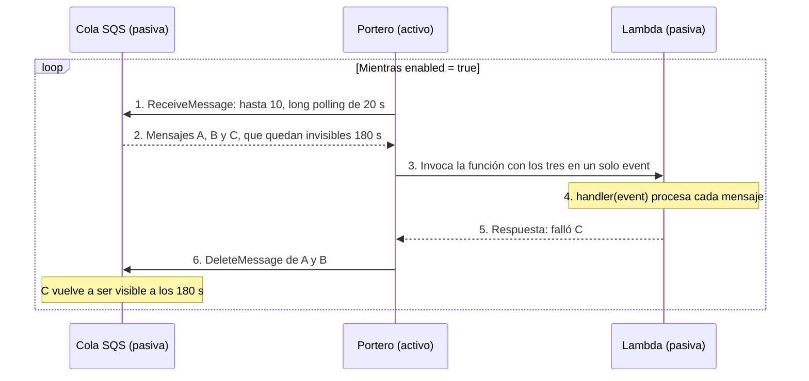

# El event source mapping: cómo se comunican la cola y la Lambda

Por qué la Lambda no tiene ni una línea de código de SQS y, aun así, procesa los mensajes de la
cola. Y dónde se puede ver esto funcionando en la consola de AWS.

---

## 1. La clave: ni la cola ni la Lambda llaman a la otra

Casi toda la confusión viene de aquí. Parece que la cola le pasa los mensajes a la Lambda, o
que la Lambda va a mirar la cola. **Ninguna de las dos cosas es cierta**, porque las dos son
pasivas:

| Pieza | ¿Toma la iniciativa? | Por qué |
|---|---|---|
| **Cola SQS** | ❌ Nunca | Es un almacén: no llama a nadie, solo responde cuando le preguntan |
| **Lambda** | ❌ Nunca | Si no hay trabajo, **no existe**: no hay contenedor encendido que pueda esperar |
| **Event source mapping** | ✅ Siempre | Es la única pieza activa. La gestiona AWS y funciona sin parar |

Si los dos extremos son pasivos, hace falta alguien **en medio** que mueva las cosas: el
*event source mapping* (ESM), al que en este proyecto llamamos **el portero**.

La analogía: la cola es un **buzón**, que no llama a tu puerta. La Lambda es un **cocinero que
nunca sale de la cocina**, y que ni siquiera está en el edificio hasta que alguien lo llama. El
portero baja al buzón, sube las cartas a la cocina y después tira las que ya se han atendido.

## 2. Hace lo mismo que se hizo a mano

El portero no hace nada nuevo: **automatiza exactamente lo que se hizo a mano en la
[prueba manual](PRUEBA-MANUAL.md)**, solo que en bucle y sin descanso.

| Paso | En la prueba manual | El portero |
|---|---|---|
| Pedir mensajes | `aws sqs receive-message` | Operación `ReceiveMessage` |
| Leer el contenido | Un script de Python abría el `Body` | Se lo pasa a `handler()` |
| Borrar lo procesado | `aws sqs delete-message --receipt-handle ...` | Operación `DeleteMessage` |

El `ReceiptHandle` que hacía falta para borrar a mano, el portero lo guarda al recibir el
mensaje y lo usa para borrarlo.

## 3. El ciclo



**Paso 1. El portero pregunta a la cola si tiene mensajes.** Pide como máximo 10, por
`batch_size = 10`. Con *long polling*, si la cola está vacía la pregunta espera hasta 20
segundos antes de responder "nada".

**Paso 2. La cola entrega los mensajes y los vuelve invisibles** durante 180 segundos, el
*visibility timeout*. Mientras el portero los tiene, nadie más los ve.

**Paso 3. El portero despierta a la Lambda** y le pasa los mensajes en una lista dentro de un
único objeto, el `event`. Cada elemento, un *record*, tiene esta forma:

```json
{
  "messageId":      "msg-A",
  "receiptHandle":  "AQEB...",
  "body":           "{\"version\": \"0\", \"id\": \"evt-A\", ... \"detail\": {...}}",
  "attributes":     { "ApproximateReceiveCount": "1" },
  "eventSource":    "aws:sqs",
  "eventSourceARN": "arn:aws:sqs:eu-west-1:<ID_CUENTA>:workingevents-resenyas"
}
```

| Campo | Para qué sirve |
|---|---|
| `messageId` | El nombre del mensaje. Es lo que devuelve la Lambda en el paso 5 para decir cuál falló |
| `receiptHandle` | El comprobante para borrarlo. Lo usa el portero en el paso 6, no el código |
| `body` | El texto con el sobre de EventBridge dentro: la primera capa de las tres |
| `ApproximateReceiveCount` | Cuántas veces se ha entregado ya. Al llegar a 3, la cola lo aparta a la DLQ |

Los mensajes reales traen algunos atributos más, como marcas de tiempo, que aquí no se usan.

**Paso 4. La Lambda procesa cada mensaje.**

**Paso 5. La Lambda le dice al portero cuáles fallaron:**
`{"batchItemFailures": [{"itemIdentifier": "msg-C"}]}`. La Lambda **no borra nada**: solo
informa, y `itemIdentifier` es el `messageId`.

**Paso 6. El portero actúa sobre la cola:** borra A y B con `DeleteMessage`, y deja C, que
volverá a ser visible a los 180 segundos.

**Y vuelta a empezar.** En un ciclo posterior, el portero recibe otra vez C, ahora con
`ApproximateReceiveCount: 2`. Si falla por tercera vez, **la propia cola** lo aparta a la DLQ.
Eso no lo hace el portero, sino la `redrive_policy` con `maxReceiveCount = 3` de `cola.tf`.

## 4. ¿Con qué permisos habla el portero con la cola?

El rol de la Lambda tiene estos permisos:

```hcl
actions = ["sqs:ReceiveMessage", "sqs:DeleteMessage", "sqs:GetQueueAttributes"]
```

**El Python no llama a ninguna de esas tres operaciones.** Están ahí porque el portero trabaja
**en nombre de la Lambda, con el rol de la Lambda**. Por eso la conexión tiene un `depends_on`
sobre los permisos: al crearla, AWS comprueba en ese momento que el rol ya puede leer la cola.

Es justo lo contrario de cómo entran los mensajes en la cola:

| | EventBridge → SQS | SQS → Lambda |
|---|---|---|
| Dirección | EventBridge **empuja** hacia la cola | El portero **tira** de la cola |
| Quién concede el permiso | **La cola**: "acepto mensajes de esta regla" | **El rol de la Lambda**: "puedo leer y borrar de esta cola" |
| Dónde está | `cola.tf`, `aws_sqs_queue_policy` | `lambda.tf`, `aws_iam_role_policy` |

La regla práctica: cuando alguien **te trae** algo, el permiso lo das tú, con una política en el
recurso. Cuando **vas tú a buscarlo**, el permiso lo llevas encima, con una política en tu
identidad.

## 5. Qué controla cada línea de Terraform

```hcl
resource "aws_lambda_event_source_mapping" "cola_a_analizador" {
  event_source_arn        = aws_sqs_queue.resenyas.arn
  function_name           = aws_lambda_function.analizador.arn
  enabled                 = var.flujo_activo
  batch_size              = 10
  function_response_types = ["ReportBatchItemFailures"]
  scaling_config {
    maximum_concurrency = 2
  }
  depends_on = [aws_iam_role_policy.analizador]
}
```

| Línea | Qué controla |
|---|---|
| `event_source_arn` | **De dónde** pide mensajes (paso 1) |
| `function_name` | **A quién** despierta (paso 3) |
| `batch_size` | Cuántos mensajes pide como máximo (pasos 1 y 2) |
| `function_response_types` | Que **lea** la lista de fallidos del paso 5. Sin ella, si falla un mensaje, da por fallido el lote entero |
| `maximum_concurrency` | Cuántos ciclos pueden ir **a la vez** |
| `enabled` | Si el ciclo está **en marcha** |

## 6. Simularlo en local

[`simular_esm.py`](../src/lambda/simulacion/simular_esm.py) ejecuta un ciclo con tres mensajes:
A (negativo), B (neutro) y C (roto a propósito). El paso 4 es **el código real de la Lambda**;
el portero y SNS están imitados con `print`.

```bash
python -B src/lambda/simulacion/simular_esm.py
```

```
PASO 4   | La Lambda ejecuta handler(event):
      [log] {"resenya": "rev-A", ..., "sentimiento": "NEGATIVO", "alerta": true, ...}
      [SNS] enviaria el correo -> ALERTA resenya 2/5 - rev-A
      [log] {"resenya": "rev-B", ..., "sentimiento": "NEUTRO", "alerta": false, ...}
      [log] Fallo al procesar el mensaje msg-C

PASO 5   | La Lambda DEVUELVE al portero:
          {"batchItemFailures": [{"itemIdentifier": "msg-C"}]}

PASO 6   | El portero lee esa respuesta y actua sobre SQS:
          msg-A: DeleteMessage -> desaparece de la cola
          msg-B: DeleteMessage -> desaparece de la cola
          msg-C: NO lo borra -> reaparecera en 180 s (al tercer fallo, SQS lo manda a la DLQ)
```

## 7. El portero trabaja aunque no haya reseñas

Como pregunta a la cola sin parar, el portero genera peticiones a SQS **aunque la cola esté
vacía**. El *long polling* las reduce mucho, y deberían caber de sobra en el millón de
peticiones gratuitas al mes. Se ven en la métrica `NumberOfEmptyReceives` de la cola, y son
otro motivo para el interruptor: `flujo_activo = false` **detiene al portero**.

## 8. Dónde verlo en la consola

### 8.1 Antes de entrar

- La consola de esta cuenta solo es accesible con el **usuario raíz**
  ([ENTORNO](ENTORNO.md#33-la-consola-solo-es-accesible-con-el-usuario-raíz)).
- Comprueba **el número de cuenta** arriba a la derecha y que la región sea
  **Europa (Irlanda), eu-west-1**.

### 8.2 Qué se puede ver y qué no

**No hay ninguna pantalla donde se vea al portero trabajar en directo**: es una pieza interna
de AWS. Lo que sí se ve es su **configuración** y sus **huellas**, es decir, las métricas y los
logs que deja cada paso. No ves al portero, pero sí el libro de registro que firma y el buzón que
va vaciando.

### 8.3 Sitio 1: la función, pestaña de desencadenadores

**Lambda → Functions → `workingevents-analizador` → Configuration → Triggers.**

Arriba aparece un diagrama con la caja de la función y, a su izquierda, una caja **SQS**
conectada. **Esa línea es el portero.** En sus detalles se ven los valores de Terraform: estado
`Enabled`, lote de 10, concurrencia máxima de 2, *report batch item failures* activado y su UUID.

⚠️ **No uses el botón para desactivarlo.** El siguiente `terraform apply` lo volvería a
activar, porque el código dice `enabled = true`: es deriva de configuración. Para apagarlo, usa
`flujo_activo = false`.

### 8.4 Sitio 2: la cola, el mismo portero desde el otro lado

**SQS → Queues → `workingevents-resenyas` → Lambda triggers.**

Es el mismo portero, con el mismo UUID. Que aparezca en las dos pantallas confirma que no
pertenece ni a la cola ni a la función: **está entre las dos**.

### 8.5 Sitio 3: las huellas en la cola

**En la cola → Monitoring.** Cada métrica refleja un paso del ciclo:

| Métrica | Paso | Qué se ve |
|---|---|---|
| `NumberOfEmptyReceives` | 1, con la cola vacía | El portero preguntando sin parar |
| `NumberOfMessagesReceived` | 2 | Mensajes entregados al portero |
| `NumberOfMessagesDeleted` | 6 | Mensajes borrados tras procesarse bien |
| `ApproximateNumberOfMessagesNotVisible` | entre el 2 y el 6 | Mensajes en vuelo |
| `ApproximateAgeOfOldestMessage` | — | Si sube, el portero no da abasto o está parado |

Las métricas de SQS llegan con **unos minutos de retraso**.

### 8.6 Sitio 4: las huellas en la función

**La función → Monitor.**

| Métrica | Qué muestra |
|---|---|
| `Invocations` | Paso 3: cada vez que el portero despierta a la función |
| `Duration` | Paso 4: cuánto tarda `handler()` |
| `ConcurrentExecutions` | Copias a la vez. **Nunca debería pasar de 2** |
| `Errors` | Invocaciones que **fallaron enteras** |

Una sutileza con `Errors`: si falla un solo mensaje, como C en la simulación, **no cuenta como
error**. Para Lambda, esa invocación terminó bien, porque `handler()` capturó la excepción y
devolvió una respuesta normal. Los fallos de mensajes sueltos se ven en los logs y, al tercer
fallo, en la DLQ. `Errors` solo sube si la función entera revienta. Por eso hay una alarma para
cada caso: ver [OBSERVABILIDAD](OBSERVABILIDAD.md#6-tres-redes-cada-una-para-un-fallo-distinto).

### 8.7 Sitio 5: los logs

**CloudWatch → Log groups → `/aws/lambda/workingevents-analizador`.** Cada contenedor escribe
en su propio *log stream*, y cada invocación deja un bloque como este:

```
START RequestId: ...                    <- el portero despertó a la función (paso 3)
{"resenya": "rev-...", ...}             <- el código (paso 4)
END RequestId: ...
REPORT ... Duration: 287 ms  Billed Duration: 649 ms  Max Memory Used: 93 MB  Init Duration: 361 ms
```

`Init Duration` solo aparece en la primera invocación de cada contenedor: **es el arranque en
frío**, medido.

## 9. Desde la terminal

```powershell
aws lambda list-event-source-mappings --region eu-west-1
```

Muestra el portero con su `State`: `Creating` mientras se crea, `Enabled` cuando funciona y
`Disabled` con `flujo_activo = false`.

El campo `LastProcessingResult` **no se rellena con colas SQS**: se quedó en `null` antes y
después de procesar mensajes. Para saber si el portero trabaja, hay que mirar las métricas y los
logs.
