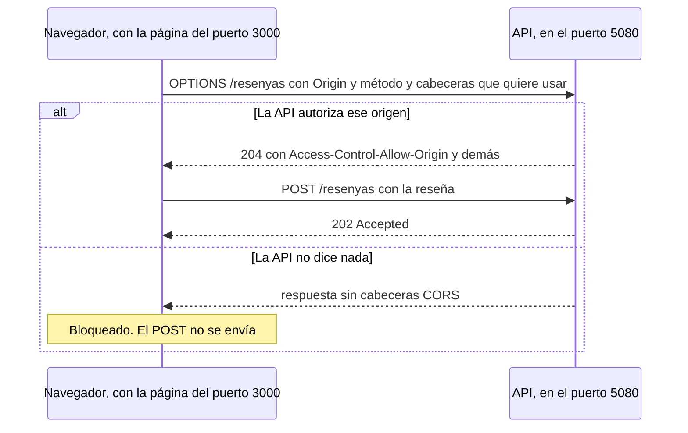

# El frontal en Next.js, y CORS

La página donde el cliente deja su reseña. Código en [`src/web/`](../src/web/).

La mitad de este documento trata sobre **CORS**, porque es lo primero que falla al conectar
una página web con una API, y el error que muestra el navegador no explica casi nada.

---

## 1. Resultado

| Prueba | Qué pasó |
|---|---|
| Enviar una reseña **antes** de configurar CORS | ❌ El navegador la bloqueó. **El POST ni siquiera se envió**: la Lambda no recibió nada |
| La misma reseña **después** de configurar CORS | ✅ `202`, y la Lambda la analizó: 3 estrellas, NEUTRO, sin alerta |
| La pregunta previa desde una página **ajena** | La API respondió **sin** las cabeceras de permiso, así que un navegador la bloquearía |
| Enviar sin elegir estrellas | El **navegador** detuvo el envío sin llamar a nadie |
| Enviar datos inválidos con la validación del navegador desactivada | La **API** respondió `400`, y el formulario mostró cada error junto a su campo |

## 2. React y Next.js, desde cero

**React** es una librería para construir interfaces a base de **componentes**: funciones que
devuelven lo que hay que dibujar. Un componente puede tener **estado**, es decir, datos que
recuerda entre un dibujado y el siguiente. Cada vez que el estado cambia, React vuelve a
dibujar el componente con el valor nuevo.

**Next.js** es un marco de trabajo construido sobre React que añade lo que React no trae de
serie:

| Qué añade | En este proyecto |
|---|---|
| **Las rutas salen de las carpetas** | `app/page.tsx` es la página de `/`. No hay un fichero de rutas aparte |
| **Componentes de servidor y de cliente** | La página se ejecuta en el servidor; el formulario, en el navegador |
| **Un servidor de desarrollo** | `npm run dev` compila al vuelo y recarga la página al guardar |
| **Variables de entorno** | `.env.local`, con una regla importante sobre el prefijo `NEXT_PUBLIC_` |

Se usa **TypeScript**: JavaScript con tipos, como en C#. Así, errores como confundir un número
con un texto aparecen al compilar y no en el navegador del cliente.

## 3. El proyecto

Se generó con `create-next-app` 16.3.5, eligiendo cada opción explícitamente:

| Opción | Por qué |
|---|---|
| `--empty` | Un proyecto vacío, para que todo lo que hay dentro se escribiera a propósito, como en la API |
| `--ts` | TypeScript |
| `--no-tailwind` | CSS normal: un concepto menos que aprender |
| `--app` | El sistema de rutas actual de Next.js, el *App Router* |
| `--disable-git` | El proyecto ya tiene su repositorio |

| Fichero | Qué es |
|---|---|
| `package.json` | La ficha del proyecto: dependencias y comandos (`dev`, `build`, `lint`). Es el equivalente del `.csproj` |
| `package-lock.json` | Las versiones **exactas** instaladas, para que todos instalen lo mismo |
| `tsconfig.json` | Cómo compila TypeScript. `@/*` es un atajo para importar desde la raíz del frontal |
| `app/layout.tsx` | El marco común de todas las páginas: `<html>`, `<body>` e idioma |
| `app/page.tsx` | La página de inicio |
| `app/globals.css` | Los estilos, con modo oscuro si el sistema lo tiene activado |
| `componentes/FormularioResenya.tsx` | El formulario |
| `servicios/resenyas.ts` | La única pieza que habla con la API |

Next.js 16.3.5 instala React **19.2.8**, aunque ya exista la 19.3: cada versión de Next.js fija
la de React con la que se ha probado.

## 4. Servidor y navegador: `"use client"`

En Next.js, los componentes se ejecutan **por defecto en el servidor**, y al navegador solo le
llega el HTML resultante. Así funciona `app/page.tsx`, que es texto fijo.

Un formulario no puede funcionar así, porque tiene que reaccionar a lo que escribe el usuario, y
eso solo pasa en el navegador. Por eso `FormularioResenya.tsx` empieza con `"use client"`.

**La consecuencia importante:** la llamada a la API la hace **el navegador del cliente**, no el
servidor de Next.js. Y en cuanto un navegador llama a otra dirección, entra en juego CORS.

## 5. El estado del formulario

```tsx
const [calificacion, setCalificacion] = useState(0);
```

`useState` devuelve dos cosas: el valor actual y una función para cambiarlo. Al elegir la
tercera estrella se llama a `setCalificacion(3)`, React vuelve a dibujar el componente, y las
tres primeras estrellas aparecen llenas junto al texto "Normal".

Las estrellas son en realidad **botones de opción** (`<input type="radio">`) invisibles, con una
estrella dibujada encima. Así funcionan con el teclado y con los lectores de pantalla sin
programar nada.

## 6. `servicios/resenyas.ts`: hablar con la API

### 6.1 Tres resultados posibles

```ts
export type Resultado =
  | { tipo: "aceptada"; id: string; eventId: string }
  | { tipo: "invalida"; errores: Record<string, string[]> }
  | { tipo: "error"; mensaje: string };
```

Es la misma idea que `ResultadoPublicacion` en la API: quien llama recibe algo ya
interpretado, no una respuesta HTTP en crudo. Y TypeScript obliga al formulario a contemplar
los tres casos.

### 6.2 `fetch` solo falla cuando no hay respuesta

`fetch` es la función del navegador para hacer peticiones HTTP. Tiene un comportamiento que se
parece a la trampa de `PutEvents`:

| Situación | ¿`fetch` lanza un error? |
|---|---|
| La API responde `202`, `400` o `502` | **No.** Son respuestas, y se devuelven con normalidad |
| La API está apagada | **Sí** |
| El navegador bloquea la respuesta por CORS | **Sí** |

Y desde el código **no se pueden distinguir los dos últimos casos**: el navegador oculta el
motivo a propósito, para no dar pistas a una página sobre servidores que no debería poder
mirar. El motivo solo aparece en la consola del navegador (F12). Por eso el mensaje de error
del formulario sugiere mirarla.

### 6.3 Los errores de validación, campo a campo

La API devuelve los errores en el formato estándar de .NET:

```json
{ "errors": { "Comentario": ["..."], "Calificacion": ["..."], "Email": ["..."] } }
```

Las claves llegan en mayúscula, como las propiedades de C#, y se pasan a minúscula para que
coincidan con los nombres de los campos del formulario.

## 7. `NEXT_PUBLIC_`: lo que ve todo el mundo

La dirección de la API está en `.env.local`:

```
NEXT_PUBLIC_API_URL=http://localhost:5080
```

**El prefijo `NEXT_PUBLIC_` significa que el valor se copia dentro del JavaScript que descarga
el navegador.** Cualquiera que abra la página puede leerlo. Por eso solo puede ir ahí lo que no
es secreto, como una dirección; nunca una clave.

| Fichero | ¿Se versiona? | Para qué |
|---|---|---|
| `.env.example` | ✅ Sí | La plantilla: dice qué hay que rellenar |
| `.env.local` | ❌ No | Los valores de tu máquina |

El `.gitignore` que genera Next.js ignora **todo** lo que empiece por `.env`, así que hubo que
añadir una excepción, `!.env.example`, para que la plantilla sí se versione.

## 8. Dos validaciones, con papeles distintos

| | Validación del navegador | Validación de la API |
|---|---|---|
| Cómo | Atributos `required`, `minLength` y `type="email"` | Atributos `[Required]`, `[Range]`… en `NuevaResenya` |
| Cuándo actúa | Al instante, sin llamar a nadie | Al recibir la petición |
| Para qué | **Comodidad**: avisar pronto a quien escribe | **Seguridad**: es la que manda |
| ¿Se puede saltar? | Sí: con `curl`, o desactivándola en la consola | No |

Se probaron las dos:

- **Sin elegir estrellas**, el navegador detuvo el envío: el campo de estrellas es obligatorio.
- **Con la validación del navegador desactivada** (`form.noValidate = true` en la consola, que
  es lo que podría hacer cualquiera), la API respondió `400` y el formulario mostró cada error
  junto a su campo.

Esa segunda prueba destapó un defecto: **los mensajes de la API estaban en inglés**, porque eran
los textos por defecto de .NET. Se tradujeron en la propia API con `ErrorMessage`, porque son
sus mensajes y cualquier otro cliente también los recibe:

```csharp
[Range(1, 5, ErrorMessage = "Elige una valoración de 1 a 5 estrellas.")]
```

## 9. CORS, desde cero

### 9.1 Qué es un origen

Un **origen** es la combinación de **esquema + nombre + puerto**. Basta con que cambie uno de
los tres para que sea otro origen:

| Dirección | Origen |
|---|---|
| `http://localhost:3000` (el frontal) | `http` + `localhost` + `3000` |
| `http://localhost:5080` (la API) | `http` + `localhost` + **`5080`** → **otro origen** |

Están en la misma máquina, pero para el navegador son dos sitios distintos.

### 9.2 La política del mismo origen

Por defecto, **una página no puede leer las respuestas de otro origen.** Esa regla la aplica el
navegador para proteger **a quien navega**. Sin ella, una página maliciosa abierta en otra
pestaña podría pedirle datos a tu banco usando tu sesión iniciada y leer la respuesta.

La analogía: el navegador es un **secretario desconfiado**. Una página le puede pedir que envíe
cartas a otros sitios, pero no le entrega la respuesta salvo que el remitente haya escrito en
ella *"la página de tal origen puede leer esto"*. Esa autorización son las **cabeceras CORS**
(*Cross-Origin Resource Sharing*).

### 9.3 La pregunta previa (*preflight*)

Algunas peticiones se consideran delicadas, por ejemplo un POST con cuerpo JSON. Con esas, el
navegador **pregunta antes de enviar**:



| Cabecera de la pregunta | Significado |
|---|---|
| `Origin: http://localhost:3000` | Quién pregunta |
| `Access-Control-Request-Method: POST` | Qué método quiere usar |
| `Access-Control-Request-Headers: content-type` | Qué cabeceras quiere enviar |

| Cabecera de la respuesta | Significado |
|---|---|
| `Access-Control-Allow-Origin: http://localhost:3000` | Ese origen puede leer las respuestas |
| `Access-Control-Allow-Methods: POST` | Ese método está permitido |
| `Access-Control-Allow-Headers: Content-Type` | Esa cabecera está permitida |

### 9.4 Lo que se vio sin CORS

La pregunta previa, hecha a mano con `curl`:

```
HTTP/1.1 405 Method Not Allowed
Allow: POST
```

La API no sabía responder a `OPTIONS` y, sobre todo, **no devolvió ninguna cabecera
`Access-Control-Allow-Origin`**. En el navegador, el formulario mostró su mensaje de error y la
consola dijo:

> *Access to fetch at 'http://localhost:5080/resenyas' from origin 'http://localhost:3000' has
> been blocked by CORS policy: Response to preflight request doesn't pass access control check:
> No 'Access-Control-Allow-Origin' header is present on the requested resource.*

Y un dato clave: en los logs de la Lambda no apareció ninguna reseña. Como la pregunta previa
falló, **el navegador ni siquiera envió el POST**.

### 9.5 La configuración

En `Program.cs`:

```csharp
var origenesPermitidos = builder.Configuration.GetSection("Cors:OrigenesPermitidos").Get<string[]>() ?? [];
builder.Services.AddCors(opciones => opciones.AddPolicy("frontal", politica => politica
    .WithOrigins(origenesPermitidos)
    .WithMethods("POST")
    .WithHeaders("Content-Type")));
...
app.UseCors("frontal");
```

- **Se autoriza lo justo:** unos orígenes concretos, solo POST y solo `Content-Type`. En lugar de
  `AllowAnyOrigin`, que dejaría leer las respuestas a cualquier página.
- **`UseCors` va antes de los endpoints**, porque tiene que responder a la pregunta previa antes
  de que llegue a ellos.
- **La lista de orígenes sale de la configuración**, y no es la misma en todos los entornos:

| Fichero | Orígenes | Cuándo se carga |
|---|---|---|
| `appsettings.json` | Ninguno | Siempre. Es lo que valdría en producción, donde se añadirá el dominio real |
| `appsettings.Development.json` | `http://localhost:3000` | Solo si `ASPNETCORE_ENVIRONMENT = Development`, que pone `launchSettings.json` |

Es justo el caso para el que existe `appsettings.Development.json`: un valor que solo tiene
sentido en tu máquina. Ver [CONFIGURACION-API](CONFIGURACION-API.md).

### 9.6 Lo que se vio con CORS

La misma pregunta previa, desde dos orígenes:

```
Desde http://localhost:3000             Desde http://pagina-ajena.ejemplo
HTTP/1.1 204 No Content                  HTTP/1.1 204 No Content
Access-Control-Allow-Headers: Content-Type
Access-Control-Allow-Methods: POST
Access-Control-Allow-Origin: http://localhost:3000
```

Fíjate en la página ajena: la API **no la rechaza**, responde `204` igual, pero **sin cabeceras
de permiso**. Es el navegador quien bloquea.

Con CORS configurado, el formulario mostró *"¡Gracias! Hemos recibido tu reseña"*, y la reseña
se siguió por su identificador hasta los logs de la Lambda.

### 9.7 CORS no protege la API

Es el malentendido más habitual. **CORS lo aplica el navegador para proteger a quien navega. No
protege al servidor.** `curl`, Postman o cualquier servidor ignoran estas cabeceras por
completo: la API sigue abierta a cualquiera que la llame directamente.

Proteger la API de verdad, con autenticación y un límite de peticiones, es otro asunto que queda
pendiente para antes de desplegarla en la Fase 8.

### 9.8 La alternativa que no se eligió

El formulario también podría enviar la reseña **al servidor de Next.js**, y que fuera este quien
llamara a la API. Entre dos servidores no hay CORS, y además la dirección de la API no llegaría
al navegador.

Se eligió la llamada directa desde el navegador porque es la configuración más habitual de una
página que habla con una API, y porque CORS había que entenderlo de todas formas. La decisión se
revisará en la Fase 8.

## 10. Arrancarlo

Hacen falta las dos piezas a la vez, cada una en su terminal:

```powershell
dotnet run --project src/api
```

```powershell
cd src/web
npm install                            # solo la primera vez
copy .env.example .env.local           # solo la primera vez
npm run dev
```

Después se abre `http://localhost:3000`.

Una reseña de 1 o 2 estrellas, o con un texto negativo, **envía un correo de alerta de verdad**.
Para probar sin generar correos, usa 3 estrellas y un texto neutro.

## 11. Lo que todavía no hace

- **No está desplegado:** solo funciona en local. Llegará en la Fase 8.
- **No tiene protección contra abusos**, ni en el frontal ni en la API (ver 9.7).
- **No tiene pruebas automáticas.** Se comprobó a mano, con el navegador y con `curl`.
